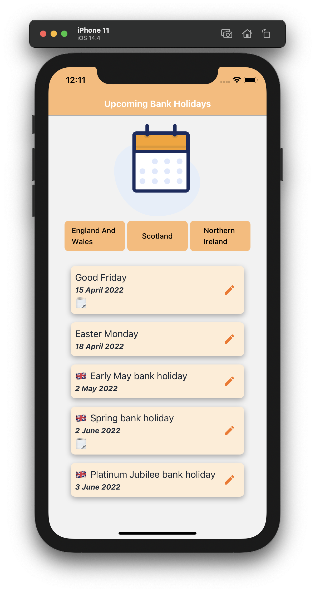
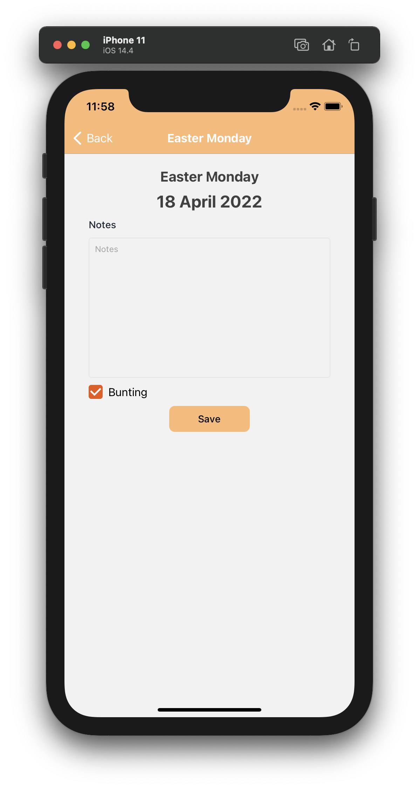

# UK Bank Holidays App

## Demo

## Local Install

1. Clone repo: `git clone https://github.com/juditlehoczki/ukbankholidays.git`

2. Enter folder: `cd ukbankholidays`

3. Install Expo: `npm install --global expo-cli`

4. Install dependencies: `npm install`

5. Start Expo: `expo start`

6. Make your choice of using an iOS or Android emulator or install the Expo App ([iOS App](https://apps.apple.com/app/apple-store/id982107779), [Android App](https://play.google.com/store/apps/details?id=host.exp.exponent&referrer=www)) to scan the QR code from your physical mobile device.

## Tech Stack

- [React Native](https://reactnative.dev/)
- [Expo](https://expo.dev/)
- data from the [UK Goverment's website](https://www.gov.uk/bank-holidays.json)
- tested with [Jest](https://jestjs.io/)
- I used [Redux](https://redux.js.org/) just to showcase my knowledge but it was definitely an overkill. :)

## An App To Display Upcoming UK Bank Holidays

- Home screen
  - the user is presented with the maximum of 5 upcoming bank holidays that fall within the next six months
  - the user can select which region's bank holidays they wish to see
- Edit screen
  - each bank holiday can be edited (note added, bunting flag changed)

## Styles

- [Native Base](https://nativebase.io/) component library used for ease

## Testing

Testing was carried out with Jest.
Tests can be run with: `npm test`

- Components are tested with a snapshot and unit tests that cover basic functionality (not complete).
- Redux actions and reducer tested.
- Util functions tested.
- Mock data is used from the tests folder.

## Code Formatting

Prettier is used for code formatting, VSCode is setup to format all files on save.
